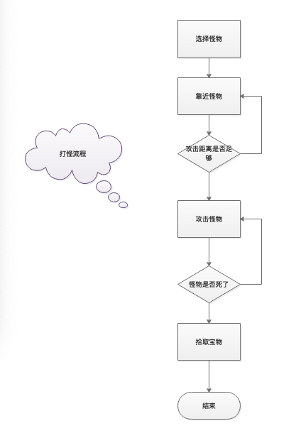
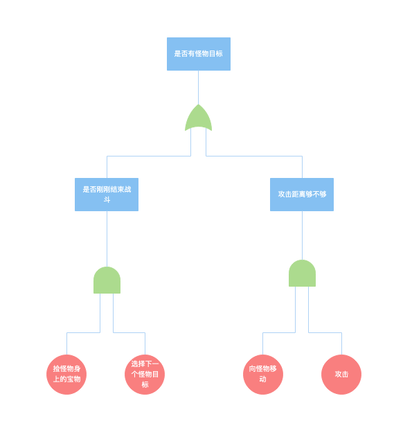
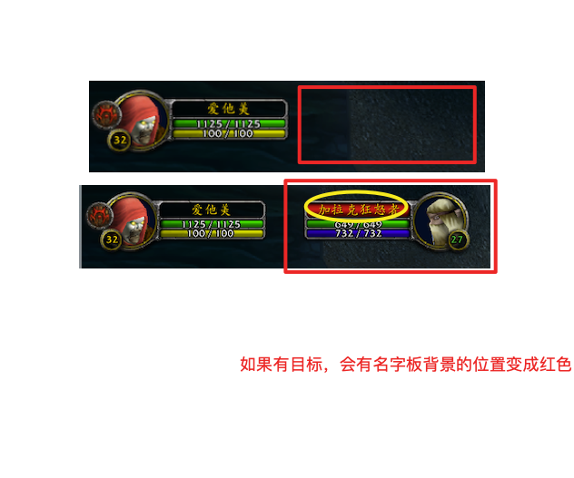
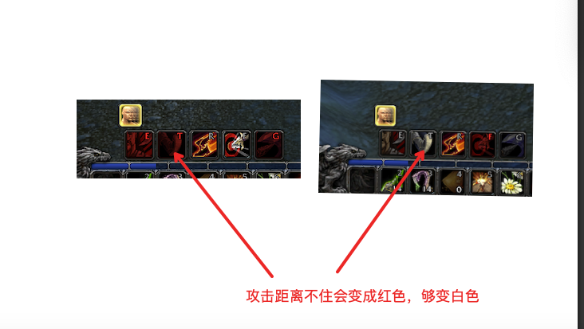
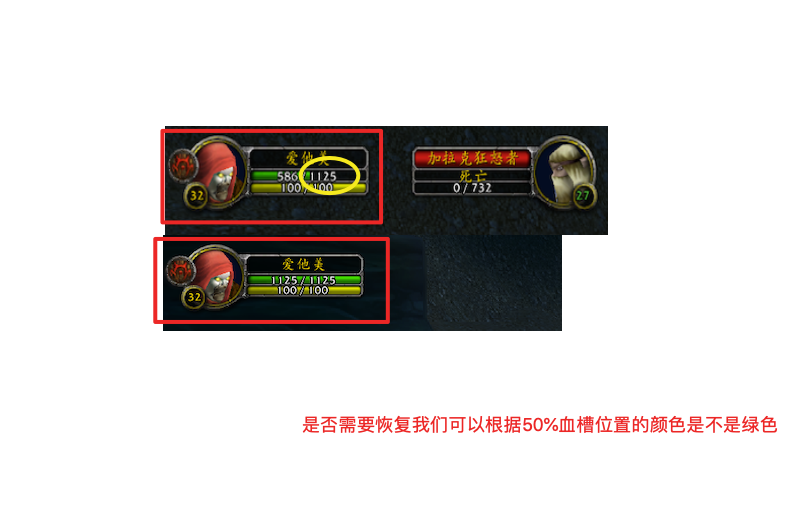
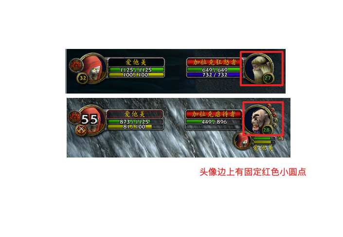
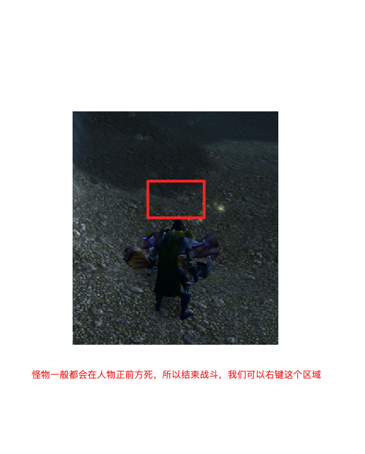
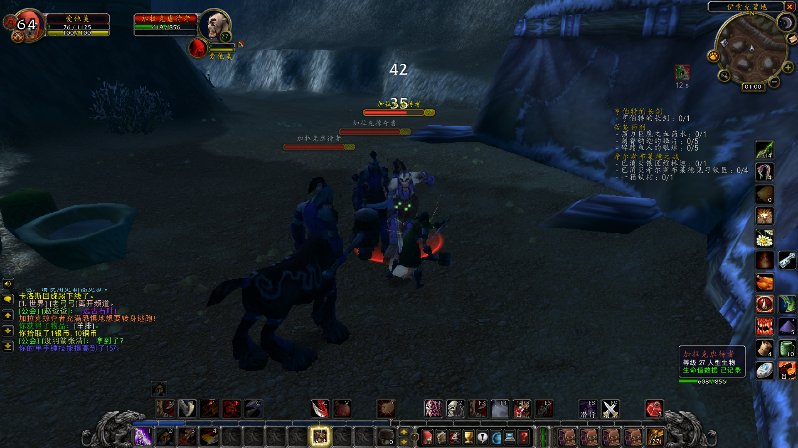
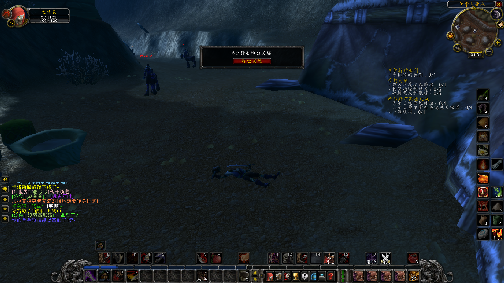

# 30分钟教你制作魔兽世界自动打怪辅助脚本


## 准备与设置

### 一、创建选择怪物宏

大家可以到游戏中创建选择怪物的宏：

- 选择附近怪物：    /targetenemy （缺点范围比较近，基本只能40码左右）
- 选择名字开头匹配： /target 山 （即可匹配以山开头的敌人，山狮、山猫等等）

将宏拉到技能栏上，设置快捷键

### 二、设置与目标交互快捷键、鼠标点击移动

目标交互功能路径： esc-按键设置-选中目标-与目标互动

鼠标点击移动：esc-界面设置-鼠标-勾选鼠标移动-点击游戏视角模式总是

作用：设置完毕后，当用户点击这个功能的时候，游戏角色会向目标（目标只能是活的）走去，我们后面要利用这个功能实现向怪物靠近的功能

### 三、锁定视角

设置路径：esc-界面设置-镜头-镜头跟随模式选总是-自动跟随速度拉到最快

作用：设置完毕后，游戏的第三视角会保持跟人物视角一致，这么做主要是因为人物攻击的时候需要面对怪物，并且拾取宝物的时候一般怪物野都是死在人物的正前方。

## 脚本编写

### 一、脚本原理

- 打怪流程图



- AI的设计过程,后期只需要不断重复这个过程



### 二、关键判断

- 是否存在目标



- 攻击距离是否够



- 血量是否危险



- 是否拥有3颗连接点释放终结技



- 拾取宝物



- 是否战斗结束（这个可以通过上一轮思考有目标，下一轮思考没目标来作为判断条件）

### 三、pyautogui库

文档地址：[pyautogui](https://pyautogui.readthedocs.io/en/latest/)

- 关键函数：press 模拟键盘按下
- 关键函数：rightClick 速表右击
- 关键函数：pixelMatchesColor 读取某个坐标点颜色是否匹配


### 四、伪代码
```
While(1){
    if 存在怪物目标（pixelMatchesColor名字板背后是不是红色） then
        if 攻击距离是否足够（pixelMatchesColor脚踢是不是白色） then
            if 是否有3连击点（pixelMatchesColor怪物头像第三连击点颜色） then
                释放技能攻击怪物（按下键盘按钮 press：2）
            else
                释放技能攻击怪物（按下键盘按钮 press：1）
        else
            向怪物移动 （按下目标互动按钮 press：j）
    else
        if 是否是刚刚战斗结束 then
            拾取宝物 （速表右键怪物的尸体：rightClick）
            if 状态是否需要恢复（（pixelMatchesColor血条50%是不是绿色） then
                恢复（潜行等20s 或者打个绷带、喝水）
        else
            开始选择下一个目标（按下键盘按钮 目标宏对应位置 press：3）

    Thead.sleep(200);
}
```

### 五、结局

这只是个5毛钱的AI，各位慎用，仅用以辅助偷懒，一般情况下你如果不盯着游戏，一般结局不久会是这样：





## 最后

如果大家有兴趣欢迎大家PR完善脚本 ：）。脚本大家随意参考，如果大家学会了也可以请我喝杯奶茶，嘿嘿~~


